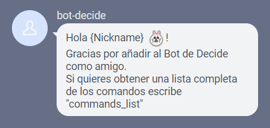
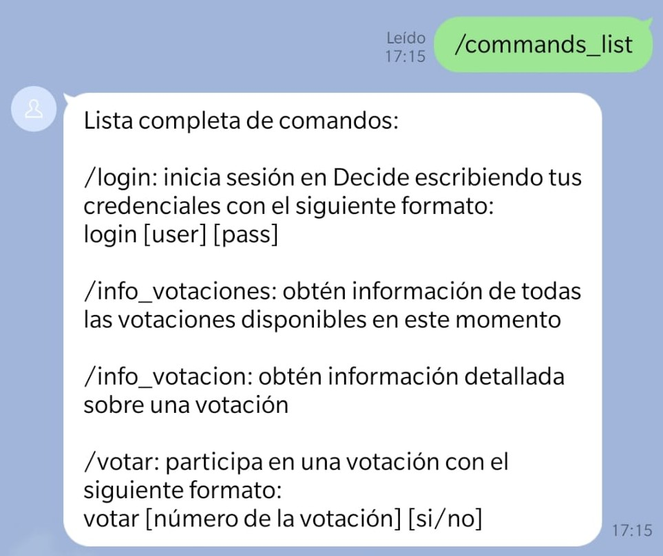
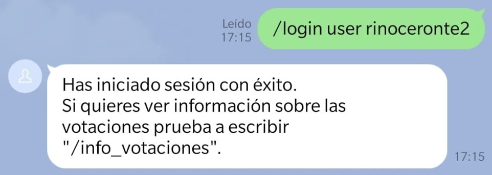
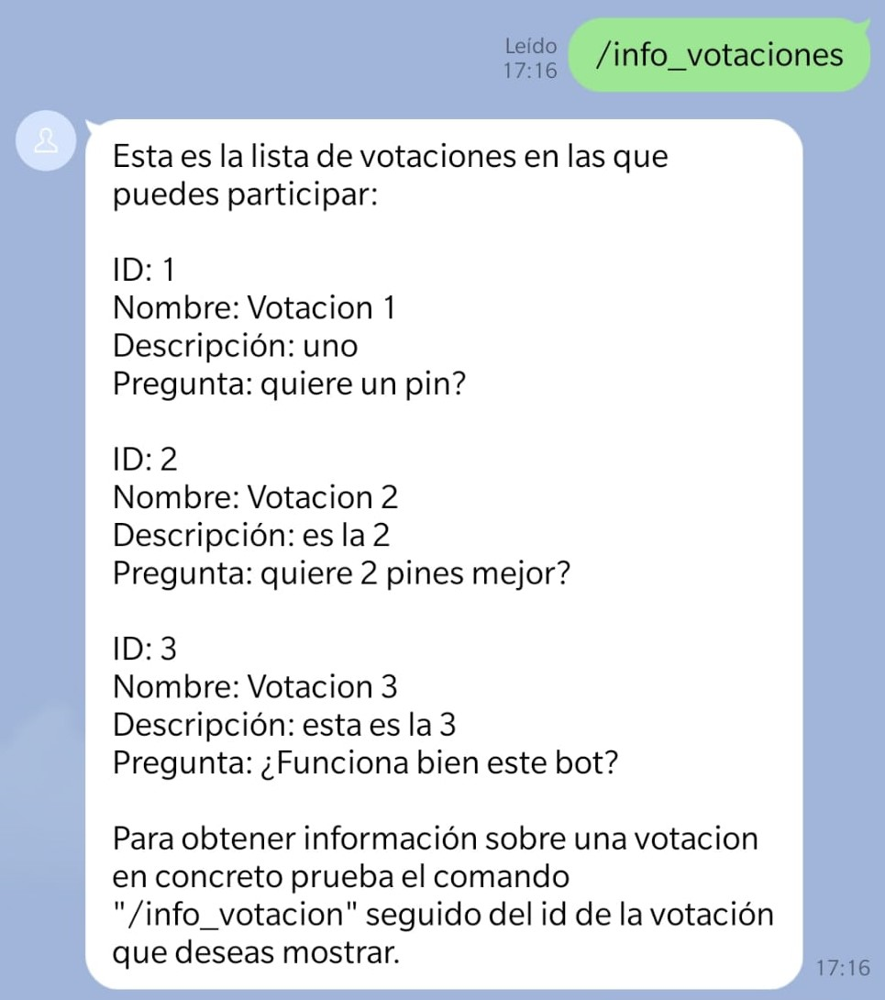
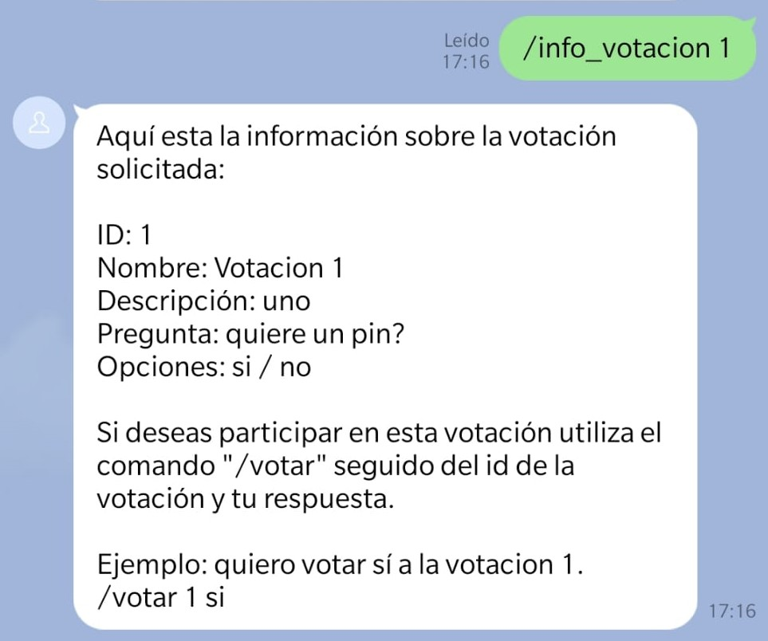
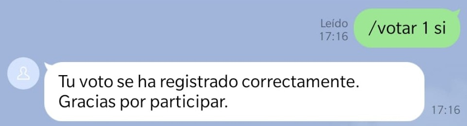

# Bot de Line

## Proposito

Este bot tiene como propósito permitir votaciones al sistema de decide a través de Line.

## Comandos disponibles

<table style="width: 100%; text-align: center;">
  <tr>
    <td style="width: 33%;">Comando</td>
    <td style="width: 33%;">Parámetros de entrada </td>
    <td style="width: 33%;">Funcionalidad</td>
  </tr>
  <tr>
    <td style="width: 33%;">/commands_list </td>
    <td style="width: 33%;">... </td>
    <td style="width: 33%;">Muestra un listado de todos los comandos disponibles para el usuario</td>
  </tr>
  <tr>
    <td style="width: 33%;">/login </td>
    <td style="width: 33%;">Usuario y contraseña </td>
    <td style="width: 33%;">Inicia sesión en Decide para poder acceder a las votaciones</td>
  </tr>
  <tr>
    <td style="width: 33%;">/info_votaciones</td>
    <td style="width: 33%;">... </td>
    <td style="width: 33%;">Muestra un listado de todas las votaciones en las que el usuario puede participar</td>
  </tr>
    <tr>
    <td style="width: 33%;">/info_votacion</td>
    <td style="width: 33%;">ID votación </td>
    <td style="width: 33%;">Muestra los detalles de una votación en concreto</td>
  </tr>
    <tr>
    <td style="width: 33%;">/votar</td>
    <td style="width: 33%;">ID votación y respuesta </td>
    <td style="width: 33%;">Realiza el voto a la votación indicada en el ID </td>
  </tr>
</table>

## Manual de uso

### Primer contacto

El primer paso es añadir al bot como amigo en la plataforma Line. Al agregarlo, debería llegarnos un mensaje similar al siguiente:

### /commands_list

Podemos acceder a un listado completo de los comandos disponibles:

### /login

Para poder acceder a las votaciones será necesario iniciar sesión en Decide. Al iniciar sesión podremos acceder a toda la información sobre votaciones disponibles, así como partipar en ellas.

### /info_votaciones

Para obtener una lista completa con todas las votaciones en las que el usuario puede participar usaremos este comando.

### /info_votacion

Si se desean obtener más detalles sobre una votación en concreto, podemos utilizar este comando.

### /votar

Para participar en una votación utilizaremos este comando.

